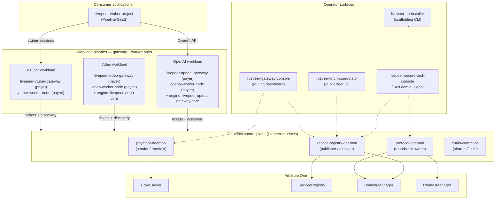
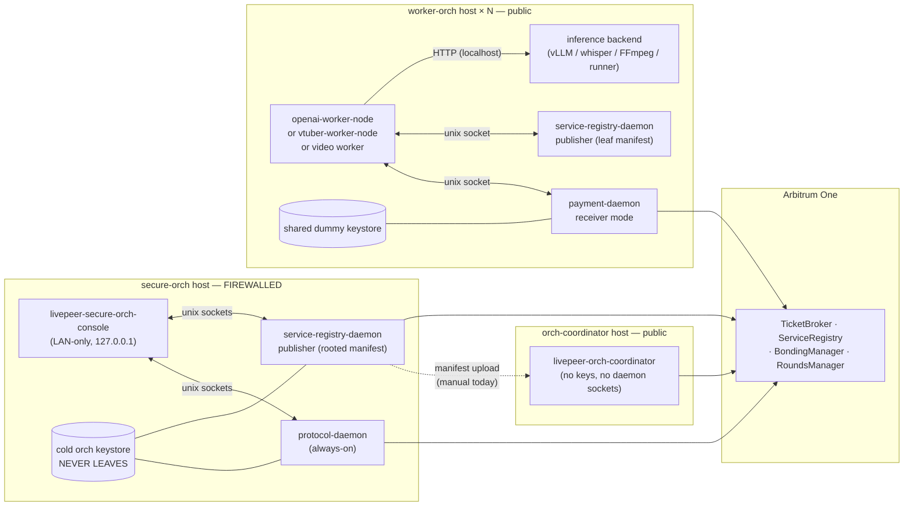
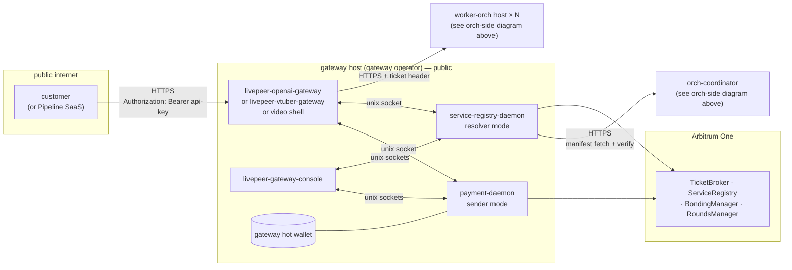
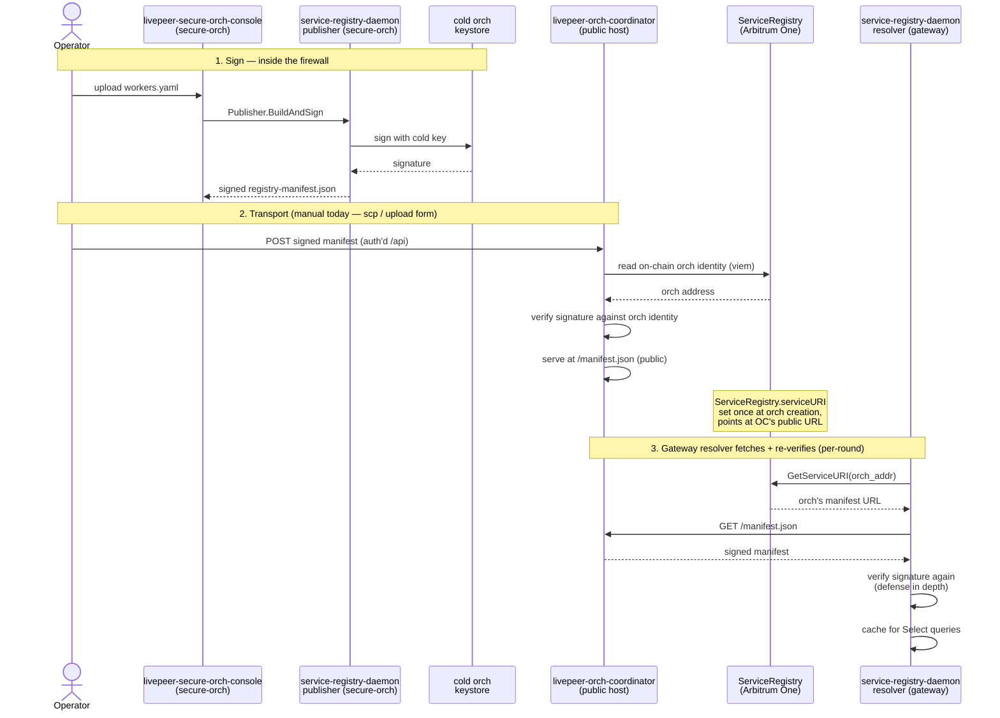
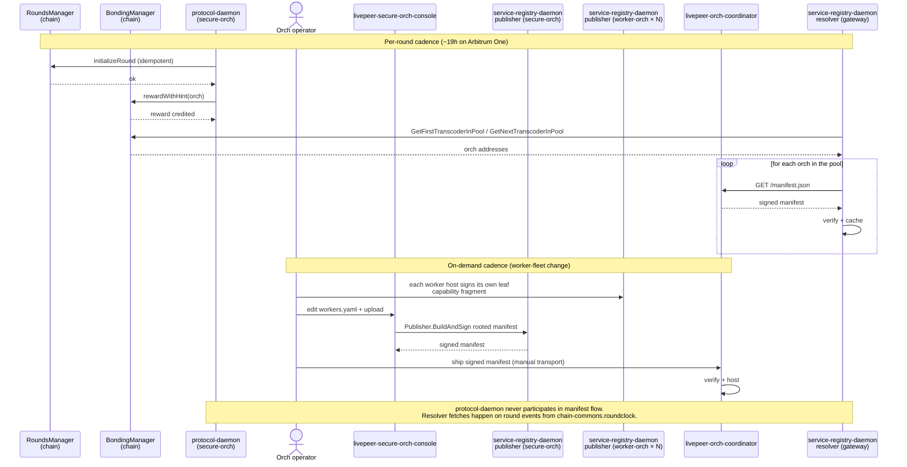
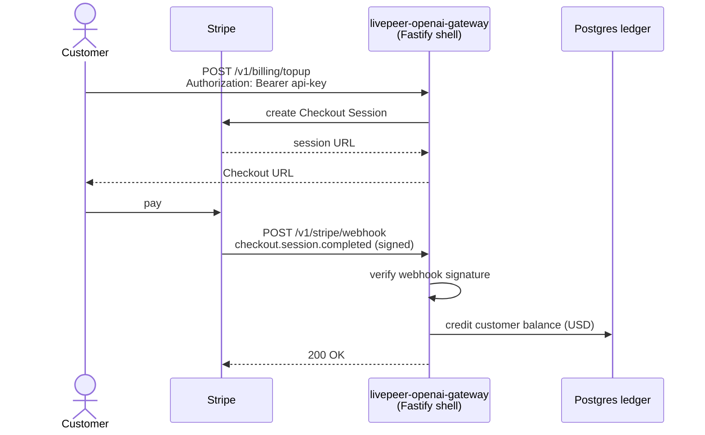
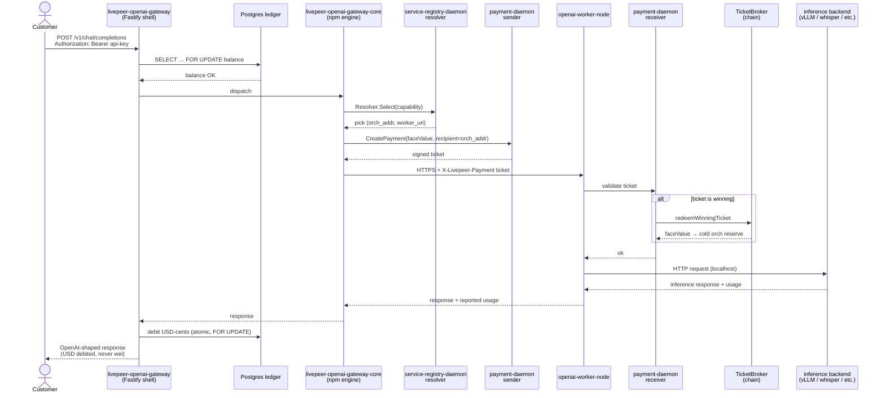
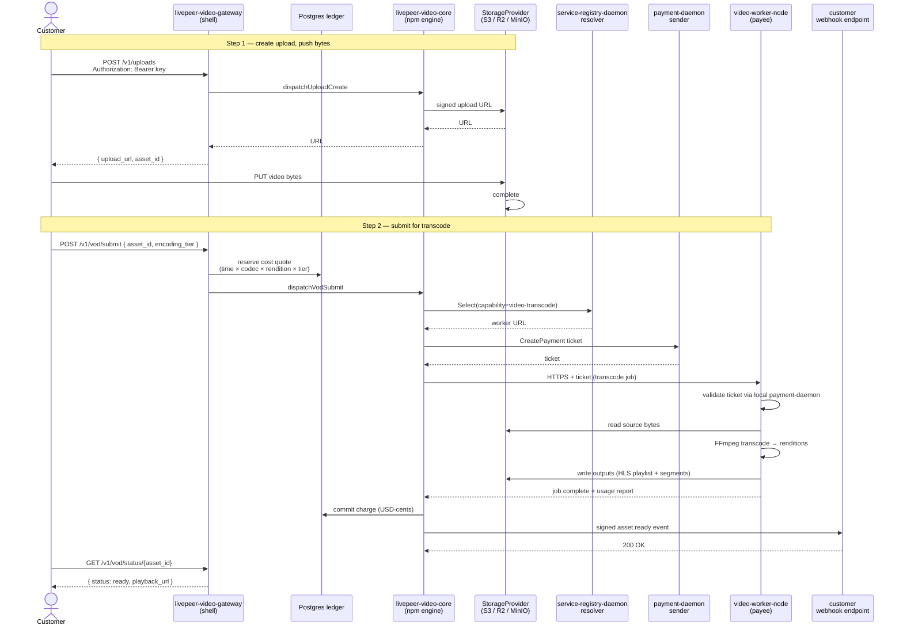
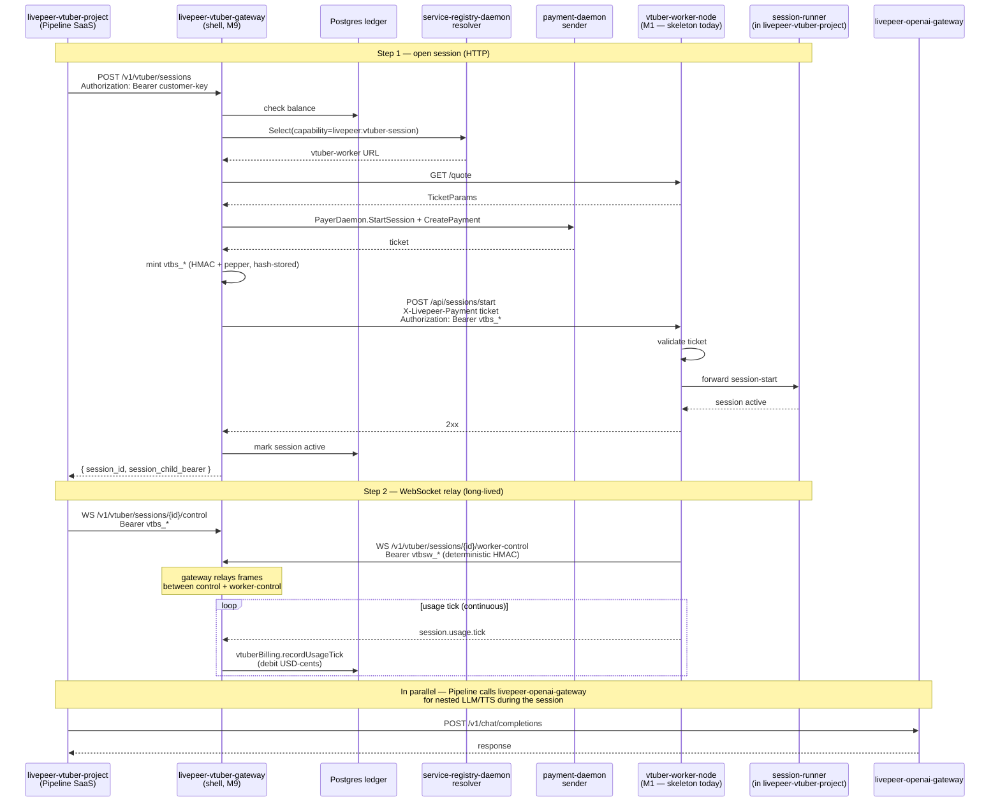

# Suite architecture

How the submodules of the Livepeer Network Suite fit together. This is the
**living high-level overview** — every submodule add/remove updates this doc in
the same PR.

> Status: under construction. Submodules are being added one at a time; this
> doc grows with each addition.

## v3.0.0 — archetype A is the canonical deployment

Effective with the suite-wide v3.0.0 cut (see
[`docs/exec-plans/active/0003-archetype-a-deploy-unblock.md`](../exec-plans/active/0003-archetype-a-deploy-unblock.md)),
**archetype A is the only supported deployment**:

- **Workers** (openai-worker-node, vtuber-worker-node, video-worker-node)
  are **registry-invisible**. They do not dial publisher daemons. They
  expose a uniform `/registry/offerings` HTTP endpoint the
  orch-coordinator scrapes (per
  [`worker-offerings-endpoint.md`](https://github.com/Cloud-SPE/livepeer-modules/blob/main/service-registry-daemon/docs/design-docs/worker-offerings-endpoint.md)).
- **Operator** uses the orch-coordinator's SPA to maintain a roster
  (with optional scrape-and-confirm against `/registry/offerings`),
  composes a `workers.yaml` proposal, hand-carries it to the secure-orch
  host, signs via `Publisher.BuildAndSign`, hand-carries the signed
  manifest back, and the coordinator atomic-swaps it to the public
  `/.well-known/livepeer-registry.json`.
- **Gateways** discover orchs via `service-registry-daemon` (resolver
  mode) sidecars calling `Resolver.Select(capability, offering, tier,
  ...)`. Pricing flows from the manifest's `offerings[].price_per_work_unit_wei`.

The pre-v3.0.0 worker-publisher pattern (workers self-publishing their
manifests directly) is no longer supported. This resolves the
"publisher-on-worker semantics" question raised as Item 10 in
[`docs/exec-plans/active/0002-suite-wide-alignment.md`](../exec-plans/active/0002-suite-wide-alignment.md).

The v3.0.0 cut also renamed `Capability.Model` → `Capability.Offering`
and `models[]` → `offerings[]` across the wire (manifest schema, proto,
all consumer code) — see plan 0003 §Decision 4. Operators now think in
terms of "offerings" (priced tiers under a capability), which reads
naturally for AI workloads (gpt-oss-20b), video presets (h264-1080p),
and streaming session tiers (vtuber-1080p30).

## Top-level component diagram

The suite stacks in five layers. Top layers depend on bottom layers; bottom
layers don't know top layers exist. Solid arrows are runtime data flow;
dotted arrows are control / configuration paths.



The five layers, top to bottom:

- **Consumer applications** — Cloud-SPE products that *use* the platform via
  customer-facing APIs. One submodule today (`livepeer-vtuber-project`).
- **Workload binaries** — gateway + worker pairs (and optional engines)
  per workload type. OpenAI, video, vtuber today; transcode-only / custom
  expected later.
- **Operator surfaces** — the four operator-facing tools (installer,
  three consoles). They mount daemon sockets but never participate in
  customer traffic.
- **On-chain control plane** (`livepeer-modules`) — chain-commons lib +
  three daemons. Talks to chain via RPC; talks to the layer above via
  unix-socket gRPC.
- **Arbitrum One** — the four contracts the suite cares about.

Sub-diagrams later in this file zoom into specific flows.

## Trust zones and network topology

A different lens: **what physically runs where, and what crosses each
host boundary**. Two operator entities (orchestrator + gateway) own four
host archetypes between them. The orch operator runs three host
archetypes; the gateway operator runs one.

Two diagrams below — orchestrator side and gateway/customer side. The
chain (`Arbitrum One`) is shared; everything else stays in its operator
domain.

### Orchestrator side

The three hosts the orch operator runs. The cold key never crosses a
host boundary; manifests do.



**Key invariants on the orch side:**

- **Cold orch keystore lives only on the firewalled `secure-orch` host.**
  Signs round txs (via `protocol-daemon`) and the rooted manifest (via
  `secure-orch-console` → publisher daemon).
- **Workers run their own publisher daemon** that signs only their own
  leaf manifest fragment — *not* the rooted manifest. (Open
  architectural question — see end of this doc.)
- **`livepeer-orch-coordinator` is the only public orch-side host that
  holds no keys and mounts no daemon sockets.** Verifies signatures on
  read; that's it.

### Gateway / customer side

The gateway operator runs one host archetype. Customer traffic enters
here; payment tickets and resolved worker URLs leave here heading at the
worker-orch hosts above.



**Key invariants on the gateway side:**

- **Gateway hot wallet lives on the gateway host**, owned by a
  different entity than the orchestrator. Used by the sender daemon to
  sign probabilistic tickets.
- **The customer-facing API is the only ingress** — `Authorization: Bearer`
  on every request. No internal-only sockets between application code
  (e.g., Pipeline) and gateways; even Cloud-SPE's own consumer apps
  use the public API.
- **`livepeer-gateway-console`** mounts the same two daemon sockets the
  app does, but for read-only routing dashboard / sender wallet status
  / manual `Resolver.Refresh()`. It does not sit in any per-request path.

### Suite-wide invariants

Both diagrams share these:

- **All daemon access is unix-socket only.** No cross-host gRPC.
  Anything crossing a host boundary is HTTPS (or chain RPC).
- **127.0.0.1 bind for every operator-facing app.** Operators front
  with their own reverse proxy (Traefik / nginx / Caddy / cloudflared /
  Tailscale Funnel). The compose files ship Traefik labels as a
  starting point; ignorable.
- **No OIDC, no sessions, no cookies.** Bearer tokens at the
  application layer, full stop.

The `livepeer-up-installer` doesn't appear above — it runs **once** on
each host to materialize `compose.yaml` + `.env` + placeholder keystore,
then exits. Not part of the runtime topology.

## What each submodule contributes

### `livepeer-modules` — on-chain control plane

Pinned at `v2.1.0-6` (`2e3ca33`).

A Go monorepo with one library and three daemons:

- **`chain-commons`** — shared library: Arbitrum RPC, signing, durable tx-intent
  state (BoltDB), log subscriptions, Controller resolver, gas oracle, time
  source, BondingManager + RoundsManager read-only bindings.
- **`payment-daemon`** — probabilistic micropayment ticket handling.
  - `sender` mode (gateway): signs tickets for outbound requests.
  - `receiver` mode (worker-orch): redeems winning tickets via `TicketBroker`,
    crediting the cold orch's reserve via `--orch-address`.
- **`service-registry-daemon`** — capability advertisement and discovery.
  - `publisher` mode (secure-orch, on-demand): builds and signs the manifest
    with the cold keystore.
  - `resolver` mode (gateway): walks `BondingManager` per round to discover
    active orchs, fetches and signature-verifies their manifests.
- **`protocol-daemon`** — `initializeRound` + `rewardWithHint`. Always-on on
  the secure-orch host.

Daemons talk **gRPC over unix sockets only** — never TCP. Cross-host
coordination goes through the chain (TicketBroker, BondingManager, etc.).
Each daemon owns its own BoltDB; there's no shared state between daemons.

#### Host archetypes

The repo ships compose stacks for three host roles in `deploy/`:

| Archetype | Daemons | Holds | Internet-facing |
|---|---|---|---|
| `secure-orch` | `protocol-daemon` (always-on) + `service-registry-daemon` publisher (on-demand) | Cold orch keystore | No (firewall-only) |
| `worker-orch × N` | `payment-daemon` receiver + workload binaries | Shared dummy keystore | Yes |
| `gateway` | `service-registry-daemon` resolver + `payment-daemon` sender + a gateway service (e.g. `livepeer-openai-gateway`) | Gateway hot wallet | Yes |

Workload binaries (transcode, AI workers, OpenAI adapters) are **not** in
`livepeer-modules` — they live in other submodules and consume the daemon
gRPC sockets.

#### Published images (v1.0.0)

- `tztcloud/livepeer-payment-daemon:v1.0.0`
- `tztcloud/livepeer-service-registry-daemon:v1.0.0`
- `tztcloud/livepeer-protocol-daemon:v1.0.0`

distroless/static, nonroot uid 65532, amd64-only.

#### Sibling repos this submodule expects

`livepeer-modules`'s README references four operator-facing repos. They're
independent — daemons work without them — but adopting them is the
recommended path:

- ✅ `livepeer-up` — added as `livepeer-up-installer` (see below).
- ✅ `livepeer-secure-orch-console` — added (see below).
- ✅ `livepeer-orch-coordinator` — added (see below).
- ✅ `livepeer-gateway-console` — added (see below).

### `livepeer-up-installer` — operator scaffolding CLI

Pinned at `v0.1.0-3` (`bd9f3ff`). Image: `tztcloud/livepeer-up:dev`.
Distroless static Go binary.

The first thing an operator runs on a new host. It **writes files only** —
materializes `/srv/livepeer/<role>/` with `compose.yaml`, a placeholder
`.env`, a placeholder keystore, and a `NEXT-STEPS.md` runbook, then exits.
It does **not** mount `docker.sock`, **not** launch any daemon, and **not**
manage TLS or a reverse proxy. Analogous to `cargo new` / `helm create` /
`terraform init`.

#### Subcommands by host role

The installer covers **four** host roles — one more than `livepeer-modules`'s
`deploy/` ships, because `coordinator` is its own role anchored by the
(not-yet-added) `livepeer-orch-coordinator` repo.

| Subcommand | Materializes | Maps to which `livepeer-modules` archetype |
|---|---|---|
| `livepeer-up secure-orch` | protocol-daemon stack + console overlay | `secure-orch` |
| `livepeer-up worker` | payment-daemon (receiver) + workload slot | `worker-orch` |
| `livepeer-up coordinator` | fleet dashboard + signed-manifest hosting | (none — needs `livepeer-orch-coordinator`) |
| `livepeer-up gateway` | resolver + sender + gateway-service slot | `gateway` |

Auxiliary subcommands: `<role> doctor [--rpc-dial]` (read-only diagnostics
including a real `eth_chainId` liveness check), `keystore` (V3 JSON +
password file at mode 0600), `bearer` (random base64 token), `version`.

#### Cross-pinning relationship to the meta-repo

The installer ships **embedded compose templates** for each role. Some of
those templates are verbatim copies from upstream sibling repos — kept in
lockstep via `templates.lock.json` at the installer's repo root, which pins
each entry to a 40-char commit SHA. `make sync-templates` bumps the SHAs;
`make sync-templates-check` is a CI dry-run drift check.

This means **two layers of pinning** exist for the suite:

1. **This meta-repo** pins each submodule (e.g., `livepeer-modules` → `2e3ca33`).
2. **`livepeer-up-installer/templates.lock.json`** pins SHAs of upstream
   sibling repos that supply its templates.

For a release to be coherent, those SHAs must agree where they overlap.
A future extension to `scripts/sync-submodules.sh --verify` should crosscheck
these — see `docs/exec-plans/tech-debt-tracker.md`.

### `livepeer-secure-orch-console` — cold-key custodian's admin UI

Pinned at `v0.2.0-7` (`d93dd04`). Stack: TypeScript (Fastify + Lit/Vite), the
org-standard console pattern called out in `livepeer-modules`'s README.

The operator surface for the **secure-orch** host. Lives behind the firewall
alongside `protocol-daemon` and the on-demand `service-registry-daemon`
(publisher mode). Returning operators use it daily; first-time scaffolding
of the host is `livepeer-up secure-orch`'s job.

#### What it does

- **Round + reward status** — confirms the daemon's `initializeRound` /
  `rewardWithHint` ticks landed, surfaces recent txintents from
  `chain-commons.txintent`.
- **Manifest signing** — uploads a `workers.yaml`, calls
  `Publisher.BuildAndSign` over the publisher socket, returns the signed
  `registry-manifest.json` for the operator to ship to their HTTP host.
- **Break-glass actions** — `ForceInitializeRound`, `ForceRewardCall`
  buttons (with confirm modals) for when the daemon's auto-tick falls
  behind.
- **Append-only audit log** — every authenticated action is recorded.

#### Trust + networking model

- **Binds to `127.0.0.1` only.** Not internet-facing. Operator fronts it
  with their own reverse proxy (Traefik / nginx / Caddy / cloudflared /
  Tailscale Funnel) and configures TLS however they want. The repo ships
  a `compose.prod.yaml` overlay with Traefik labels assuming an external
  `ingress` Docker network — those labels are ignorable if you front it
  another way.
- **App-layer auth: bearer token only.** `ADMIN_TOKEN` env var,
  ≥ 32 chars. No OIDC, no sessions, no cookies.
- **Daemon access: unix sockets only**, mounted into the container:
  - `protocol-daemon` at `/var/run/livepeer/protocol/protocol.sock` (rw, required).
  - `service-registry-daemon` at `/var/run/livepeer/registry/service-registry.sock` (rw, **optional** — manifest publish degrades gracefully with a clear "publisher not configured" error if absent).

#### Cross-submodule path coupling (gotcha)

The console's `npm run proto:gen` reads daemon proto definitions from the
sibling path **`../livepeer-modules-project/`** — but in this meta-repo the
on-chain control plane is checked out at **`../livepeer-modules/`**. The
GitHub repo and the project name diverge: the repo is `livepeer-modules`,
the README inside calls itself `livepeer-modules-project`. Running
`npm run proto:gen` from this checkout will fail unless the path expectation
is reconciled.

Tracked in [`exec-plans/tech-debt-tracker.md`](../exec-plans/tech-debt-tracker.md).

### `livepeer-orch-coordinator` — public fleet dashboard + manifest host

Pinned at `v3.0.0-2` (`1b84794`). Stack: same as the secure-orch console (TS,
Fastify single-process, Lit + Vite SPA at `operator-console-ui/admin/`,
Drizzle/SQLite via better-sqlite3, viem for chain reads). Node 20+
(secure-orch wants 24+, so a single Node 24 install satisfies both).

The **public face** of an orchestrator operator's fleet — same operator
entity as the secure-orch host, but a different trust posture:

- **Holds no keys**, mounts no daemon sockets, performs no signing.
- **Hosts the signed manifest publicly at `/manifest.json`** — the URL the
  on-chain `ServiceRegistry.serviceURI` points to. Public, unauthenticated.
- **Daily-ops dashboard** behind bearer-token auth at `/api/*`: maintain
  the worker roster, scrape worker Prometheus endpoints over HTTP, compose
  `workers.yaml` proposals to send to the secure-orch console, accept signed
  manifests back from the secure-orch and **verify the signature against
  the on-chain orch identity** before serving them.

Same boundary discipline as the other operator consoles:

- Binds `127.0.0.1:8080`. Single Fastify process serves both `/api/*`
  (auth'd) and `/manifest.json` (public) on the same port.
- BYO reverse proxy (Traefik / nginx / Caddy / cloudflared / Tailscale Funnel)
  for TLS and public ingress.

#### How it fits with secure-orch-console

Both consoles serve the same operator entity, but at opposite ends of the
trust gradient:

| Aspect | `secure-orch-console` | `orch-coordinator` |
|---|---|---|
| Network | LAN-only, behind firewall | Public-facing |
| Holds keys | Yes (cold orch keystore) | No |
| Daemon sockets mounted | `protocol-daemon` + publisher | None |
| Signing | Yes (`Publisher.BuildAndSign`) | No (verifies only) |
| `/manifest.json` | Generates (signed output) | Hosts (verified, served) |
| Audience | Custodian | Daily-ops |

## End-to-end manifest publishing flow

The registry manifest pipeline spans three submodules
(`livepeer-secure-orch-console`, `livepeer-orch-coordinator`, and the
gateway-side resolver in `livepeer-modules`).



**Two verifications, intentionally.** The coordinator verifies on
upload; every gateway resolver verifies again on fetch. If the
coordinator host is ever compromised, tampered manifests still don't
propagate.

**The transport step is manual today.** HTTP-probe-from-URL discovery
and a managed transport are deferred — see
`livepeer-modules/service-registry-daemon/docs/exec-plans/tech-debt-tracker.md`
under `publisher-http-probe-impl`.

## Orchestrator-side coordination

The orch-side hosts (`secure-orch`, `worker-orch × N`, `orch-coordinator`)
are linked by two cadences: a **per-round** loop driven by the chain
(initialize round + reward + resolver refresh) and an **on-demand**
loop driven by the operator (manifest update when the worker fleet
changes).



**Two daemons, two responsibilities, one host (`secure-orch`):**

- **`protocol-daemon`** owns the chain state machine (`initializeRound` +
  `rewardWithHint`). Always-on. Doesn't touch the manifest.
- **`service-registry-daemon`** in publisher mode signs the rooted
  manifest, only when the operator triggers it via
  `secure-orch-console` → `Publisher.BuildAndSign`. On-demand.

**Resolver refresh isn't a cron** — `service-registry-daemon` resolver
listens to `chain-commons.roundclock` and refreshes when a new round
starts. Mid-round, queries hit the cache. Operator can hand-trigger
`Resolver.Refresh()` for ad-hoc invalidation (this is what
`livepeer-gateway-console`'s manual refresh button does).

### `livepeer-gateway-console` — payer-side routing dashboard

Pinned at `v0.1.4-4` (`5cecca0`). Stack: same as the other
two consoles (TS, Fastify single-process, Lit + Vite SPA at `bridge-ui/admin/` _(upstream dir name; pending rename — see `exec-plans/active/0001-upstream-naming-cleanup.md`)_,
Drizzle/SQLite via better-sqlite3, viem, `@grpc/grpc-js`, pino). Node 20+.

The operator surface for the **gateway entity** — a different operator
from the orchestrator. The gateway operator runs the resolver + sender
daemons + their own gateway service (typically `livepeer-openai-gateway`);
this console is the dashboard layered on top.

#### What it does

- **Routing dashboard is the central screen.** Multi-pane: orch roster with
  capability filters, per-orch drill-down (signatures, freshness, routing
  history charts derived from the resolver's audit log + the console's own
  `routing_observations` table).
- **Capability search** — calls `Resolver.Select` to preview which orch the
  resolver would pick for a given capability/model/tier, before any real
  request fires.
- **Sender wallet status** — wallet balance from chain (viem) + escrow /
  reserve from `PayerDaemon.GetDepositInfo`.
- **Audit log** — both the resolver's own (`Resolver.GetAuditLog`) and the
  console's bearer-action log (`audit_events` table).
- **Manual cache refresh** — `POST /api/resolver/refresh` (force-refresh
  every orch) and `POST /api/resolver/refresh/:address` (one orch).
  Idempotent; the only writes the console fires.

#### Trust + networking model

- **Binds `127.0.0.1:8080`.** Single Fastify process serves auth'd `/api/*`
  + static SPA at `/admin/console/*`. Only `/healthz` is unauth'd (for
  upstream proxies).
- **App-layer auth: bearer token only** (`ADMIN_TOKEN`). Same pattern as the
  orch consoles.
- **Daemon access: unix sockets only**:
  - `service-registry-daemon` resolver mode at `/var/run/livepeer/resolver/service-registry.sock`
  - `payment-daemon` sender mode at `/var/run/livepeer/sender/payment.sock`
  Both required.

Same path-coupling gotcha as `secure-orch-console` (its `npm run proto:gen`
also reads from `../livepeer-modules-project/`). Captured in tech-debt.

## The three operator consoles, side by side

All three consoles serve the same role in different trust zones — same
stack, same bind pattern, different daemons mounted, different security
posture:

| Aspect | `secure-orch-console` | `orch-coordinator` | `gateway-console` |
|---|---|---|---|
| Operator entity | Orchestrator | Orchestrator | Gateway |
| Network posture | LAN-only (firewalled) | Public-facing | Public-facing |
| Holds keys | Cold orch keystore | None | Gateway hot wallet (via socket) |
| Daemon sockets | `protocol` + `publisher` | None (viem only) | `resolver` + `sender` |
| Signing on this host | Yes (`Publisher.BuildAndSign`) | No | Yes (sender signs tickets) |
| Public unauth'd surface | None | `/manifest.json` | `/healthz` only |
| Central screen | Round/reward status | Worker fleet | Routing dashboard |
| Stack | TS / Fastify / Lit / Drizzle / better-sqlite3 / viem | _(same)_ | _(same)_ + `@grpc/grpc-js` |
| 127.0.0.1:8080 bind | ✓ | ✓ | ✓ |
| BYO reverse proxy | ✓ | ✓ | ✓ |
| Bearer-token auth | ✓ | ✓ | ✓ |

## OpenAI workload — end-to-end flow

Two sub-flows: the **Stripe top-up loop** (one-time, async; how USD lands
in the customer's ledger) and the **per-request flow** (where USD ↔ ETH
translation happens on the hot path). Splitting them out keeps the
per-request diagram readable.

### Stripe top-up loop

How a customer's USD balance gets credited. Decoupled from any chat
request — runs on its own schedule.



**First top-up auto-upgrades** a Free customer to Prepaid atomically
with the credit (single transaction). Disputes (`charge.dispute.created`)
mark the topup disputed and pause the customer until resolved.

### Per-request flow (USD → ETH → settlement → USD debit)

A single chat completion, from gateway ingress to settlement on a
worker-orch. No Stripe in this path — the customer's USD balance must
already be credited.



**Key invariants (from `livepeer-openai-gateway`'s core beliefs):**

- **Customer never sees wei.** USD-cents on the customer surface; ETH
  micropayments only on the network side.
- **Atomic ledger debits.** `SELECT … FOR UPDATE` for both balance check
  and commit. No read-modify-write.
- **Fail-closed on payment-daemon outage** → 502/503. Billing never
  proceeds without payment.
- **Token audit is observation-only.** `tiktoken` local counts cross-
  checked against node-reported counts; drift is metered, not enforced.

`livepeer-gateway-console` reads the resolver socket (routing
dashboard + audit log + manual Refresh), the sender socket (wallet +
deposit info), and the chain via viem (wallet balance) — but doesn't
participate in any per-request path.

## Workload binaries — the engine + shell pattern

A paid HTTP adapter turns a generic HTTP service into something Livepeer
can charge for. The suite uses a consistent two-tier pattern for each
workload type:

- **Engine** — an OSS, framework-free, **adapter-driven** TypeScript
  package published to npm. Owns the request pipeline and the contract
  with the worker-node. Operators don't run the engine directly — they
  consume it from a shell.
- **Shell** — a proprietary deployable that **wires production adapters**
  (Postgres + Stripe + Redis + auth + storage + …) into the engine and
  exposes the resulting service. Each engine has at least one reference
  shell.
- **Worker** — the payee-side process that satisfies the engine's
  capability + payment-ticket protocol on a `worker-orch` host.

This shape is replicated per workload type. Today the suite contains two
pairs:

| Workload | Engine (npm) | Shell + adapters | Payee worker | Repo strategy |
|---|---|---|---|---|
| OpenAI APIs | `livepeer-openai-gateway-core` | `livepeer-openai-gateway` | `openai-worker-node` | Three separate repos, independently versioned |
| Video (VOD + Live HLS) | `livepeer-video-core` | `livepeer-video-gateway` | `video-worker-node` | Three separate repos, independently versioned |
| VTuber (`livepeer:vtuber-session`) | _(none — direct shell, no engine yet)_ | `livepeer-vtuber-gateway` | `vtuber-worker-node` (forwards to a separate `session-runner` in `livepeer-vtuber-project`) | Shell + worker as **separate repos** (like OpenAI), each forked from the corresponding OpenAI sibling skeleton. ADR-003 mandates **no shared source code** — common patterns kept in sync via byte-equivalence property tests instead |

Future workload types (transcode, custom) are expected to follow the same
shape.

> **Retired-term alert.** The `openai-worker-node` README refers to its
> payer-side counterpart as `openai-livepeer-bridge`. Both pieces of that
> name are wrong: the repo is `livepeer-openai-gateway`, and "bridge" is a
> retired term — the canonical word is **gateway**. Tracked for upstream
> cleanup in [`exec-plans/active/0001-upstream-naming-cleanup.md`](../exec-plans/active/0001-upstream-naming-cleanup.md).

### `openai-worker-node` — payee-side OpenAI adapter

Pinned at `v1.1.2-11` (`4c8dd81`). Go binary, distroless image (Cloud-SPE
convention).

The HTTP front for one or more inference backends on a worker-orch host.
Sits on the same host as `payment-daemon` (receiver mode) and forwards to
local inference services over plain HTTP.

```
livepeer-openai-gateway ──HTTPS──▶ openai-worker-node ──gRPC (unix)──▶ payment-daemon (receiver)
                                          │
                                          └── HTTP ──▶ vLLM / diffusers / whisper / TTS / …
```

#### Supported capabilities (v1)

Capability strings advertised in the worker's manifest entry:

- `openai:/v1/chat/completions`
- `openai:/v1/embeddings`
- `openai:/v1/images/generations`
- `openai:/v1/images/edits`
- `openai:/v1/audio/speech`
- `openai:/v1/audio/transcriptions`

Video generation, FFMPEG live transcoding, and other custom workloads are
backlog upstream.

#### Configuration: shared `worker.yaml` between worker and daemon

A single `worker.yaml` file is **bind-mounted into both** the worker
process and the local `payment-daemon`. They parse it independently — the
worker schema lives in `internal/config/`, the daemon's schema lives in
`livepeer-modules/payment-daemon/`. Drift between the two views is
detected at runtime via the daemon-catalog cross-check.

Each `(capability, model)` pair in the YAML routes to its own backend URL.

#### gRPC contract with the payment daemon

Protos under `internal/proto/livepeer/payments/v1/` are wire-compatible
with the daemon's. Same protos are vendored on both sides; regenerate
worker stubs with `make proto`. No common-protos package today — the proto
files are duplicated. Worth a tech-debt entry once the proto file count
grows.

#### State of the upstream repo

The upstream README calls itself "scaffolding" with "no source code yet,"
but the repo has ~290 KB of Go (config parsing, proto stubs, and the
`internal/` skeleton). The README hasn't been updated to reflect the
post-scaffold state. Captured in tech-debt.

### `livepeer-openai-gateway` — payer-side OpenAI adapter

Pinned at `v3.0.0` (`0442698`). Stack: TypeScript / Fastify single-process / Drizzle +
**Postgres** (not SQLite — billing data) / Redis / Stripe SDK /
`@grpc/grpc-js` / viem / tiktoken / pino. Layered architecture per the
harness PDF (`types → config → providers → repo → service → runtime → main`).

The customer-facing endpoint of the suite. Sits on a gateway host alongside
`payment-daemon` (sender) + `service-registry-daemon` (resolver) — the same
two daemons `gateway-console` mounts.

#### What it owns

- **OpenAI-compatible API** (`/v1/chat/completions` streaming + non-streaming,
  `/v1/embeddings`, `/v1/images/generations`, `/v1/images/edits`,
  `/v1/audio/speech`, `/v1/audio/transcriptions`). Drop-in compatible with
  the `openai` SDK via custom `base_url`.
- **Customer-facing economics in USD.** Two tiers:
  - **Free** — 100K-token monthly quota.
  - **Prepaid** — USD balance, topped up via Stripe Checkout. First top-up
    auto-upgrades a Free customer atomically with the credit.
- **USD ↔ ETH translation.** For each request: builds a micropayment via
  `payment-daemon` (sender), forwards to a worker-node, commits billing
  from the node's reported usage. Customers never see wei.
- **Token audit (observation only).** `tiktoken` local counts cross-checked
  against node-reported counts; drift is metered, not enforced.
- **Operator endpoints** under `/admin/*` — health, node inspection,
  customer lookup, manual refund, suspend/unsuspend, escrow view. Auth via
  `X-Admin-Token` (different header from customer's `Authorization: Bearer`).
- **Two embedded SPAs** — customer portal (top-ups, balance) and operator
  admin SPA (nodes, customers, refunds).

#### Hard invariants

From the upstream `core-beliefs.md`, mechanically enforced by custom
ESLint rules:

1. **Customers never see wei.** All customer-facing units are USD or tokens.
2. **Zod at boundaries.** Every HTTP body + every gRPC response parses
   through a Zod schema before entering `service/`.
3. **Providers boundary.** Cross-cutting libraries only in `src/providers/`.
4. **Atomic ledger debits.** Customer debits run under `SELECT … FOR UPDATE`.
5. **Fail-closed on payment-daemon outage** → 503. Never bills without
   payment.

#### Engine extracted as OSS

The routing/dispatch/inference engine has been carved out and published as
[`@cloudspe/livepeer-openai-gateway-core`](https://github.com/Cloud-SPE/livepeer-openai-gateway-core)
on npm (currently `3.0.0`). This repo is now the **proprietary shell**
— billing, Stripe, customer portal, admin SPA — that consumes the engine
via its npm dep.

That engine package is **another version anchor** in the suite that
doesn't live in our `.gitmodules`. Captured in tech-debt.

#### Operator surfaces overlap with `livepeer-gateway-console`

Two operator UIs now exist for the gateway entity, with non-overlapping
concerns:

| Surface | Audience inside the gateway operator | Concerns |
|---|---|---|
| `livepeer-gateway-console` (UI dir `bridge-ui/admin/` upstream — pending rename) | Network ops | Routing dashboard, capability search, manual `Refresh`, sender wallet status |
| `livepeer-openai-gateway` admin SPA | Billing / customer ops | Customer accounts, refunds, suspend/unsuspend, escrow view, node billing reconciliation |

Both mount `payment-daemon` (sender) + `service-registry-daemon` (resolver)
sockets. They could in principle be merged, but ship as separate processes
today.

#### Daemon image-version drift

The gateway README pins its docker-compose stack to:

- `tztcloud/livepeer-payment-daemon:v1.4.0`
- `tztcloud/livepeer-service-registry-daemon:v1.4.0`

But `livepeer-modules`'s README publishes those images at `v1.0.0`. So the
gateway's deployed daemon version is **ahead of** what `livepeer-modules`
documents as current. Either there's a parallel release stream, or one of
the READMEs is stale. Captured in tech-debt.

### `livepeer-openai-gateway-core` — OSS engine consumed by the gateway shell

Pinned at `v3.0.0` (`bccb3ae`). Pure TypeScript engine published to npm as
[`@cloudspe/livepeer-openai-gateway-core`](https://www.npmjs.com/package/@cloudspe/livepeer-openai-gateway-core).
Pre-1.0 versioning — breaking changes may land in any minor release;
post-1.0 will be strict semver.

The engine is the **adapter-driven request pipeline** that sits between an
OpenAI-compatible client and the Livepeer worker pool. It owns the
ordering of `auth → rate-limit → reserve → select node → call → commit`
and ships an optional Fastify route adapter plus a read-only operator
dashboard.

#### Five operator-overridable adapters

The engine commits to five adapter contracts. Operators (the shells that
consume the engine) supply the implementations:

| Adapter | Purpose | Default impl |
|---|---|---|
| `Wallet` | Billing/quota authority. Reserve before dispatch, commit on success, refund on failure. | `InMemoryWallet` (testing only) |
| `AuthResolver` | HTTP `Authorization` header → generic `Caller`. | none — wire your own |
| `RateLimiter` | Per-caller request gating (sliding window + concurrency). | Redis sliding-window |
| `Logger` | Structured log sink. | `createConsoleLogger` |
| `AdminAuthResolver` | Admin-token / basic-auth backing for the optional operator dashboard. | `createBasicAdminAuthResolver` |

`livepeer-openai-gateway` (the proprietary shell) supplies its own
`Wallet` (Postgres ledger + Stripe top-ups), `AuthResolver` (API-key
issuance), and admin auth.

#### Sidecar daemons are required

The engine **does not support a static-YAML node-pool fallback**. Running
without the registry daemon is unsupported. Both sidecars are mandatory:

- `payment-daemon` (sender mode) — micropayment ticket creation.
- `service-registry-daemon` (resolver mode) — `Select` / `ListKnown` /
  `ResolveByAddress` for the worker-node pool.

#### Engine ↔ shell version coupling

`livepeer-openai-gateway` consumes this engine as an npm dep at a pinned
version (today `3.0.0`). With both repos now in this meta-repo, the
version coupling is **doubly tracked**:

1. `.gitmodules` pins the engine source at `v3.0.0` (`bccb3ae`).
2. `livepeer-openai-gateway/package.json` pins the npm dep `@cloudspe/livepeer-openai-gateway-core@3.0.0`.

These must agree. Crosschecking is captured in tech-debt — once
implemented, `scripts/sync-submodules.sh --verify` should parse the
shell's `package-lock.json` and assert it matches the engine submodule's
tagged version.

### `livepeer-video-core` — OSS video engine (VOD + Live HLS)

Pinned at `v0.2.0-1` (`1549853`). Pure TypeScript engine published to npm as
`@cloudspe/video-core`. Pre-1.0 versioning, same conventions as the
OpenAI engine. MIT-licensed.

The video equivalent of `livepeer-openai-gateway-core`. Same engine + shell
pattern, different workload shape: VOD upload + Live HLS rather than
OpenAI APIs. Cost model is **time × codec × rendition × tier** — much
richer than the OpenAI per-token model.

#### Eleven adapters (six more than the OpenAI engine)

The OpenAI engine exposes 5 operator-overridable adapters; video exposes
**11**. The extras are video-shaped concerns the OpenAI side doesn't have:

| Adapter | Purpose |
|---|---|
| `Wallet` | reserve / commit / refund against `CostQuote(time × codec × rendition × tier)` |
| `AuthResolver` | request headers / IP → `Caller` |
| `AdminAuthResolver` | admin-token → `{ actor }` |
| `RateLimiter` | per-`(callerId, capability)` token bucket |
| `Logger` | structured log sink |
| `StorageProvider` | _(new)_ S3-shaped bytes transport — engine owns the path conventions |
| `WebhookSink` | _(new)_ signed delivery + retry queue for async events |
| `WorkerResolver` | discover workers by capability |
| `WorkerClient` | dispatch to a worker URL with a payment ticket header |
| `EventBus` | _(new)_ per-caller event emit; the `WebhookSink` fan-out lives here |
| `StreamKeyHasher` | _(new)_ argon2id / scrypt for live stream keys (and shared with API keys) |

`@cloudspe/video-core/testing` exports reference fakes for every adapter,
intentionally **not for production** — same testability pattern as the
OpenAI engine.

#### Dispatchers (framework-free entry points)

Pure functions over a `DispatchCommon` deps bag:

- `dispatchUploadCreate`, `dispatchVodSubmit`, `dispatchVodStatus`
- `dispatchLiveStreamCreate`, `dispatchLiveStreamStop`, `dispatchLiveStreamStatus`
- `dispatchPlaybackResolve`
- `dispatchAbrSubmit`, `dispatchAbrStatus` _(stubs at MVP — ABR-on-demand
  surface lands post-1.0)_

Optional Fastify adapter at `@cloudspe/video-core/fastify` registers these
as HTTP routes and maps `VideoCoreError` → JSON envelope. If Fastify
isn't your framework, the dispatchers work behind Express, Hono, h3, or
anything else — same shape as the OpenAI engine.

#### Optional read-only operator dashboard

`@cloudspe/video-core/dashboard` exports `registerOperatorDashboard(app, deps)`
for an opt-in `/admin/ops/*` mount. Vanilla TS — **no Lit / RxJS / Vite**,
unlike the operator consoles. Polls `/admin/ops/data.json` every 5s and
renders worker pool + recent assets + active live streams + recent
webhook deliveries. Adopters supply a `DashboardDataSource` (or use the
default factory).

#### Payment integration model differs from the OpenAI engine

The OpenAI engine **mandates** sidecar daemons (`payment-daemon` sender +
`service-registry-daemon` resolver) and talks to them over unix sockets.
The video engine is **less prescriptive** — it doesn't list daemon
sidecars as required, instead delegating ticket creation to the
operator's `WorkerClient` adapter ("dispatch to a worker URL with a
payment ticket header").

In practice the reference shell `livepeer-video-gateway` wires the same
`payment-daemon` sender into a `WorkerClient` adapter, but the engine
itself doesn't require it. That's a deliberate looser coupling —
letting `livepeer-video-core` work with non-Livepeer workers if a
non-ticket payment scheme is desired.

#### What this engine is not

Per the README:

- **Not a managed video platform.** You run it.
- **Not a transcoder.** The engine orchestrates work; the encode happens
  in a worker (any worker satisfying the capability + payment-ticket
  protocol).
- **Not framework-coupled.** Fastify is one optional adapter; the
  dispatchers themselves don't import any HTTP framework.

### `livepeer-video-gateway` — payer-side video shell

Pinned at `v3.0.0` (`96665ee`). Stack: TypeScript / Fastify / Drizzle
+ Postgres / Redis / `@grpc/grpc-js` / pino. Proprietary shell — wires
production adapters (Postgres ledger, S3-compatible storage, webhook
delivery, etc.) into `@cloudspe/video-core` and exposes the customer
API.

The Mux-inspired feature set: direct uploads, asset playback, live
streaming, signed URLs, webhooks. **Not Mux-API-compatible** — feature
set + resource model are modeled after Mux's, but the HTTP API surface
is different. Customers porting from Mux must update client code, not
just the base URL.

#### Repo strategy: same as OpenAI and VTuber

After the v3.0.0 split, the video workload follows the same three-repo
pattern as the OpenAI side: engine (`livepeer-video-core`, OSS, npm) +
shell (`livepeer-video-gateway`, proprietary) + worker
(`video-worker-node`). The pre-v3.0.0 monorepo `livepeer-video-platform`
that bundled shell + worker has been retired (see plan
[`0003-archetype-a-deploy-unblock.md`](../exec-plans/active/0003-archetype-a-deploy-unblock.md)
§D).

#### Daemon dependencies

The shell co-locates with a `payment-daemon` in **sender** mode for
ticket creation, and a `service-registry-daemon` in **resolver** mode
to find workers — same sidecars as `livepeer-openai-gateway`.

### `video-worker-node` — payee-side video worker

Pinned at `v3.0.0` (`765276b`). Go (~270 KB at scaffold, more after
the Phase 2 code lift). Workload-only Go daemon that performs
FFmpeg-subprocess transcoding. Sister of `openai-worker-node` — same
scaffolding pattern, different workload.

#### Runtime modes and build variants

- **Three runtime modes** (`--mode=vod|abr|live`) — pick one per process.
- **Three GPU build variants** (NVIDIA / Intel / AMD) — same source, three Docker tags.

#### Workload contracts

- HTTP `/v1/video/*` + `/stream/*` (`:8081`)
- RTMP ingest (`:1935`)
- Prometheus `/metrics` (`:9091`)
- gRPC into `payment-daemon` (receiver) over a local unix socket

Per the v3.0.0 archetype-A standardization (see
[`exec-plans/active/0003-archetype-a-deploy-unblock.md`](../exec-plans/active/0003-archetype-a-deploy-unblock.md)
§1), the worker is **registry-invisible**: it does not run a publisher
sidecar. The orch publishes the worker's capability in the rooted
manifest from `secure-orch`.

#### End-to-end video flow (VOD upload)

The video-side request flow differs from the OpenAI side in three
material ways: there's a **two-step submit** (upload then transcode),
**persistent storage** is in the loop, and **webhooks** carry async
completion events.



The Live HLS flow is similar but persistent: a single
`dispatchLiveStreamCreate` opens a session, RTMP ingest streams to the
worker, and `session.usage.tick` events drive ongoing billing the same
way `vtuber-session` does (see VTuber flow below).

#### Future cross-engine consumption (planned)

`livepeer-video-gateway` is planned to consume `livepeer-openai-gateway-core`
in phase 2 for AI-augmented features (auto-captions, scene tagging, AI
thumbnails). That's a future cross-engine dependency: the video shell
would import both `@cloudspe/video-core` and
`@cloudspe/livepeer-openai-gateway-core` from npm.

When that lands, the engine + shell pattern needs an update to its mental
model: shells can compose multiple engines, not just one.

#### Dev stack

A full `infra/compose.yaml` (in `livepeer-video-gateway`) brings up
Postgres, MinIO (S3-compatible storage for VOD assets), Redis, both
daemons, the worker, the shell, and a playback origin. `./scripts/demo.sh`
runs an end-to-end VOD + Live walkthrough.

#### Worker license is TBD

`video-worker-node` is "license TBD." The video engine is MIT; the
shell is proprietary; the worker is still unresolved. Worth surfacing
for the user — it'll affect whether operators can fork the worker.

## Consumer applications

The suite is no longer just platform — there's now an application layer
on top, written by Cloud-SPE, that **consumes the gateway/worker pairs
as a customer**. This layer is structurally above the workload-binaries
layer: it doesn't add new payment-protocol surface, it just buys minutes.

### `livepeer-vtuber-project` — autonomous AI VTuber SaaS ("Pipeline")

Pinned at main HEAD `b1bcdac` (no tag yet). Mostly Python (~790 KB), with
a small TS surface (~26 KB) for the avatar-renderer (browser-based; per
prior design notes, the Open-LLM-VTuber upstream renders in browser and
the renderer here is net-new). Forks
[Open-LLM-VTuber](https://github.com/t41372/Open-LLM-VTuber).

**Product shape:** an autonomous AI VTuber streamed live to YouTube and
other RTMP destinations. Customer-facing SaaS called **Pipeline** —
customers buy and create their own VTubers; compute runs on the Livepeer
network. Nested LLM/TTS calls go through `livepeer-openai-gateway` (the
suite's customer-facing OpenAI endpoint).

#### Position in the suite

This is the **first submodule that is a customer of the platform rather
than part of the platform**:

```
livepeer-vtuber-project (consumer app, "Pipeline" SaaS)
   │
   │ buys LLM/TTS minutes via OpenAI-compatible HTTP
   │ Authorization: Bearer <api-key issued by the gateway>
   ↓
livepeer-openai-gateway (workload-binaries layer)
   │ … routes to openai-worker-node, settles in ETH via payment-daemon
```

Pipeline doesn't talk to `payment-daemon` directly, doesn't run a
resolver, doesn't manage tickets. It's a regular OpenAI client; the
Livepeer settlement is invisible behind the gateway boundary. That's the
**correctness signal for the platform**: the existence of an internal
consumer using only the customer-facing API validates that the suite
hangs together end-to-end.

#### Forthcoming sibling repos (announced, not yet existing)

The README announces a planned pair `vtuber-livepeer-bridge` +
`vtuber-worker-node` mirroring the OpenAI siblings. Two issues with the
announced names:

1. **`bridge` is retired.** Should be `vtuber-livepeer-gateway` per the
   current naming convention.
2. **The OpenAI sibling reference (`openai-livepeer-bridge`) used in the
   README is doubly wrong:** the actual repo is `livepeer-openai-gateway`,
   and "bridge" is retired. The vtuber README has propagated the old
   name into its planning docs.

If/when the sibling pair lands, expect to revisit the naming. Tracked in
[`exec-plans/active/0001-upstream-naming-cleanup.md`](../exec-plans/active/0001-upstream-naming-cleanup.md).

#### Why this matters for the suite shape

Adding `livepeer-vtuber-project` to the suite changes the mental model in
two ways:

1. **The suite has a top-of-stack now.** Future "consumer applications"
   (other Cloud-SPE products built on the platform) belong in this layer
   too. Examples might be a recording-pipeline product, a podcast-edit
   product, anything that buys minutes from one of the gateways.
2. **Cross-suite consumption is real and bidirectional.** The video
   platform plans to consume the OpenAI engine (for AI features). The
   vtuber project consumes the OpenAI gateway. Future apps will likely
   consume the video shell. The gateways are public-facing endpoints by
   design — internal Cloud-SPE consumers use them the same way external
   customers do.

#### License

TBD. Engine repos in the suite are MIT; shells are proprietary; this
consumer SaaS is unspecified. Likely closed (it's a product), but not
yet stated. Tracked in tech-debt.

#### Active phase

The README says "architecture realignment in flight" — phase 1
(session-runner + avatar-renderer) is partially landed. The codebase is
mid-evolution. Pinning to `main` is acceptable for now but expect
churn.

### `livepeer-vtuber-gateway` — payer-side gateway for the vtuber workload

Pinned at `v3.0.0` (`929938`). TypeScript / Fastify.
Structurally **forked from the `livepeer-openai-gateway` skeleton** — same
layered architecture, same Stripe top-up flow, same Drizzle/Postgres
ledger, same lint plugin shape. Per ADR-003 (in `livepeer-vtuber-project`),
the two repos **share no source code**; common patterns are kept aligned
by byte-equivalence property tests rather than a shared library.

> The README internally still titles itself "vtuber-livepeer-bridge" —
> the actual repo is `livepeer-vtuber-gateway`. Naming cleanup is in
> flight upstream; tracked in
> [`exec-plans/active/0001-upstream-naming-cleanup.md`](../exec-plans/active/0001-upstream-naming-cleanup.md).

#### New capability on the network: `livepeer:vtuber-session`

This gateway adds a third capability string to the suite (the OpenAI
gateway exposed `openai:/v1/chat/completions` etc.; video exposes its own
set):

- `livepeer:vtuber-session` — long-lived stateful session for an
  autonomous AI VTuber.

Cost is metered as **USD-cents per usage tick**, debited from the
customer's Stripe-funded balance on each `session.usage.tick` event from
the worker. That's a third cost model in the suite (token-based for
OpenAI, time × codec × rendition × tier for video, per-usage-tick for
vtuber).

#### Customer-facing API

Four HTTP endpoints (all under `Authorization: Bearer <customer-key>`):

| Method | Path | Purpose |
|---|---|---|
| `POST` | `/v1/vtuber/sessions` | Open a session: pick a worker, fetch quote, open payer-daemon session, mint a session-scoped child bearer (`vtbs_*`), POST to worker's `/api/sessions/start`, return `session_child_bearer` |
| `GET` | `/v1/vtuber/sessions/{id}` | Status |
| `POST` | `/v1/vtuber/sessions/{id}/end` | Close session, revoke child bearer, close payer + worker |
| `POST` | `/v1/vtuber/sessions/{id}/topup` | Stripe Checkout for additional credits |

Plus two WebSocket endpoints under `/v1/vtuber/sessions/{id}`:

- `/control` — customer side. Auth via `session_child_bearer`. Customer
  sends frames like `user.chat.send`; worker → customer events are
  forwarded verbatim.
- `/worker-control` — worker side. Auth via deterministic `vtbsw_*` HMAC
  bearer derived from `(pepper, session_id)` — the worker doesn't get a
  separate provisioned key.

On `session.usage.tick` from the worker, the gateway calls
`vtuberBilling.recordUsageTick` to debit USD-cents from the customer's
ledger. Reconnect / 30s replay buffer is deferred.

#### Bridge-issued session-scoped child bearers (the `vtbs_*` token)

ADR-005 sketch: at session-open, the gateway mints a session-scoped
bearer `vtbs_<43-char-base64url>`, HMAC-SHA-256 with a server-side
pepper, hash-stored in the `vtuber_session_bearer` table. Returned to
the customer as `session_child_bearer`; the customer uses it on the
WebSocket `/control` endpoint instead of their long-lived API key. The
session-end endpoint revokes it.

The intent is **least-privilege per session**: the long-lived customer
API key is only used to open sessions; the per-session token is what
flows over the long-running WebSocket. Limits blast radius if the WS
endpoint leaks a token.

#### End-to-end VTuber session flow

The vtuber pipeline differs from the OpenAI side in three material ways:
**long-lived sessions** with a 2-step open (HTTP open + WebSocket
attach), **session-scoped child bearers** (`vtbs_*`) instead of the
customer's long-lived API key on the WS, and **per-tick billing** over
WebSocket instead of per-request.



The vtuber project (consumer-applications layer) talks to **two**
gateways in parallel:

- This one (`livepeer-vtuber-gateway`) for vtuber session orchestration.
- `livepeer-openai-gateway` for nested LLM/TTS calls inside the session.

That's the first time the suite has a single product reaching across
two workload gateways — a stronger validation of the gateway pattern
than just one consumer hitting one gateway.

#### Forked-from-template pattern

M1's commit literally "copied the `openai-livepeer-bridge` skeleton,
stripped OpenAI routes (...), the customer self-serve UI, and Stripe
top-up routes (back in M7), and adapted the package identity." So the
vtuber gateway is a **structural fork** of the OpenAI gateway —
identical scaffold, swapped business logic.

Deliberate non-sharing decision (ADR-003 in `livepeer-vtuber-project`):
the two gateways share no source code, even when the pattern is
identical. Risk of drift is mitigated by:

- Documenting common patterns in a `sibling-integration.md` table
  upstream.
- Pinning byte-shapes with property tests (e.g., `vtbs_*` token format
  pinned in `src/service/auth/sessionBearer.test.ts`) so a sibling
  gateway can be checked byte-equivalent.

This is the same trade-off `livepeer-modules` made by vendoring its
proto files into each consumer rather than publishing a shared package
— **fewer dependencies, more careful coordination**. Worth modeling for
future workloads.

#### Where the design lives

The repo's own `docs/` is intentionally minimal. Canonical design lives
in `livepeer-vtuber-project`:

- Architecture overview, `StreamingModule` interface, events taxonomy,
  credential trust boundaries, the full ADR set, and the M1-M9 build
  plan all live upstream.
- This repo is the **implementation**, not the design doc.

Different organizational pattern from `livepeer-openai-gateway` (which
keeps DESIGN.md + PRODUCT_SENSE.md in-tree). The vtuber side concentrates
design at the project level, code at the gateway/worker level.

#### Status

M1-M9 milestones complete; full MVP assembled; **348 tests pass**. The
worker side (`vtuber-worker-node`) now exists but is at M1 (skeleton
only — see below) — the M9 smoke test still has no real target to hit
until M2-M4 land on the worker.

### `vtuber-worker-node` — payee-side worker for the vtuber workload

Pinned at `v3.0.0` (`f7f6b36`). Go (~270 KB). Note the
naming: workers don't get the `livepeer-` prefix (matches
`openai-worker-node`); gateways do (`livepeer-openai-gateway`,
`livepeer-vtuber-gateway`). Consistent with the OpenAI sibling pair.

#### Status: M1 — skeleton only

The current pin is intentionally non-functional. M1 is "copy the
`openai-worker-node` skeleton and strip OpenAI-specific module code."
A binary built at this commit **refuses to start against any non-empty
`worker.yaml`** — that's the intended state for skeleton acceptance.

The real work lands in M2-M4: `StreamingModule` interface, the
`vtuber-session` module implementation, and contract tests.

So today the vtuber pair is **lopsided**:

| Side | Status |
|---|---|
| `livepeer-vtuber-gateway` | M9 — full MVP, 348 tests |
| `vtuber-worker-node` | M1 — skeleton, refuses to start |

The gateway has nothing real to dispatch to, and the M9 smoke test in
the gateway can't actually exercise the path. This is normal for
forked-skeleton pairs — one repo races ahead while the other catches
up. Worth tracking, but not alarming.

#### Architecture parallels and divergences vs `openai-worker-node`

Same overall shape:

- Go binary, distroless image (Cloud-SPE convention).
- `internal/config/` parses `worker.yaml` with daemon-catalog cross-check
  (the worker and the local payment-daemon read the same YAML
  independently, drift detected at runtime).
- `internal/runtime/http/` mux + payment middleware enforces ticket
  validation before forwarding.
- gRPC client to local `payment-daemon` (receiver mode) over unix socket.
- Custom golangci-lint analyzer (`lint/payment-middleware-check/`) — same
  harness pattern as the TS repos: enforce invariants mechanically with
  custom lints carrying remediation hints.

One divergence worth flagging:

1. **The worker is a thin payment+routing layer, not a full module.**
   It forwards session-open requests to a separate `session-runner`
   process (which lives at `livepeer-vtuber-project/session-runner/`,
   not in this repo). The OpenAI worker forwards to vLLM / diffusers /
   whisper / TTS — those are external inference engines. The vtuber
   worker forwards to a Cloud-SPE-owned session-runner that ships in a
   different repo. **Tighter coupling than the OpenAI side, with the
   coupling deliberately reaching into a sibling submodule.**

#### Archetype A: workers do not run a publisher

The pre-v3.0.0 worker (and the retired `livepeer-video-platform` worker)
co-located a `service-registry-daemon` in publisher mode. v3.0.0
finalized **Archetype A as the only deploy pattern** — workers are
registry-invisible, do not dial publisher daemons, and do not
self-publish. All capability advertisement happens via the rooted
manifest that `secure-orch` signs and the coordinator hosts. See
[`exec-plans/active/0003-archetype-a-deploy-unblock.md`](../exec-plans/active/0003-archetype-a-deploy-unblock.md)
§1 (resolves [plan 0002 §Item 10](../exec-plans/active/0002-suite-wide-alignment.md#item-10--document-publisher-on-worker-semantics)).

#### Where the design lives

Same pattern as `livepeer-vtuber-gateway`: this repo's `docs/` is
intentionally minimal until per-repo specifics emerge. The canonical
design lives upstream in `livepeer-vtuber-project`:

- `streaming-session-module.md` — the worker contract this binary will
  host.
- ADR-006 — the streaming-session payment pattern (different from
  per-request payment used by the OpenAI worker).

#### Cross-repo conventions reference

The README links to `livepeer-modules-conventions` as the home of
shared metric + port conventions. That repo doesn't exist yet (same
broken reference as in `livepeer-openai-gateway-core`'s README).
Tracked in upstream-naming-cleanup — those references should either
point at the conventions where they actually live, or
`livepeer-modules-conventions` should be created and the conventions
moved there.

## Trust and key boundaries

Encoded here so future submodule additions don't quietly break the model:

- **Cold orch keystore** — only on `secure-orch`. Signs manifest publishes
  and protocol calls. Never on a worker.
- **Dummy worker keystore** — shared across N `worker-orch` hosts. Operators
  distribute it via SSH today; KMS-backed signers are tracked tech debt
  inside `livepeer-modules`.
- **Gateway hot wallet** — only on the gateway host, owned by a different
  entity than the orchestrator.

## Open questions for future submodules

Tracked as we go, resolved when more components land:

- Where do **AI workload binaries** live, and how do they advertise capabilities
  to the publisher (auto-probe vs operator-curated `workers.yaml`)?
- ~~Will future workload types (transcode, video gen, custom) follow the
  same payer/payee adapter shape as the OpenAI pair, or diverge?~~ —
  **Answered**: yes, they do. All three workloads (OpenAI, video, vtuber)
  ship as separate engine + shell + worker repos after the v3.0.0 split.
  ADR-003 mandates no shared source code, with byte-equivalence pinned
  via property tests.
- ~~**Deployment-topology divergence: workers running a publisher.**~~ —
  **Resolved in v3.0.0**: archetype A is now the only deploy pattern.
  Workers are registry-invisible, never run a publisher, and never dial
  publisher daemons. All capability advertisement is rooted at
  `secure-orch`. See
  [`exec-plans/active/0003-archetype-a-deploy-unblock.md`](../exec-plans/active/0003-archetype-a-deploy-unblock.md)
  §1.
- `livepeer-video-gateway` **plans to consume `livepeer-openai-gateway-core`**
  in phase 2 for AI-augmented features (auto-captions, scene tagging,
  AI thumbnails). When that lands, the engine + shell pattern becomes
  many-to-one: a shell composes multiple engines.
- Do the operator consoles share an auth/token model with the gateway, or are
  they fully siloed?
- The installer pins template SHAs from upstream sibling repos
  ([`livepeer-up-installer/templates.lock.json`](../../livepeer-up-installer/templates.lock.json)).
  When sibling repos land in this meta-repo, do we collapse the two pinning
  layers, or have `--verify` crosscheck them?
